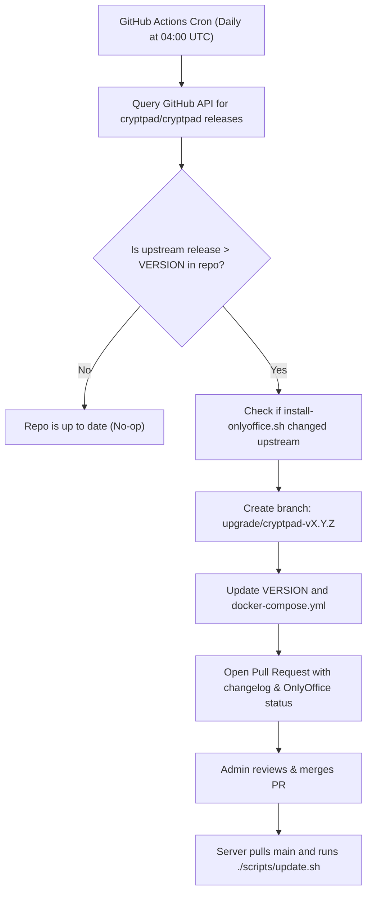

# Production CryptPad Deployment & Auto-Updating Repository

[](https://github.com/your-username/Cryptpad/actions/workflows/check-upstream.yml)
[](https://github.com/your-username/Cryptpad/actions/workflows/validate.yml)

A production-ready, security-hardened Git repository for managing and deploying [CryptPad](https://cryptpad.org/) with **automated upstream version tracking and Pull Request generation via GitHub Actions**.

---

## Architecture Overview

This deployment repository isolates your custom configurations and assets from the 500MB+ CryptPad core codebase:

* **Two-Domain Isolation Architecture**: CryptPad serves content across two separate origins to prevent Cross-Site Scripting (XSS) leaks:
  * **Main Domain (`CPAD_MAIN_DOMAIN`)**: Handles user login, account passwords, and cryptographic keys.
  * **Sandbox Domain (`CPAD_SANDBOX_DOMAIN`)**: Hosts user document editors inside sandboxed iframes under strict Content Security Policy (CSP).
* **OnlyOffice Integration**: Automatically manages CryptPad-vetted OnlyOffice builds (Document, Spreadsheet, Presentation) and WebAssembly document converters (`x2t`).
* **Automated Upstream Sync**: A scheduled GitHub Action automatically checks for new CryptPad releases, verifies OnlyOffice changes, and opens a Pull Request with the official changelog and pre-flight checklist.
* **Filesystem Database**: Data is stored as encrypted `.ndjson` edit chains across `datastore/`, `blob/`, and `block/` directories (no SQL database needed).

---

## Directory Structure

```
Cryptpad/
├── .github/
│   └── workflows/
│       ├── check-upstream.yml       # Scheduled GitHub Action checking for upstream releases
│       └── validate.yml             # CI syntax validator for configs and scripts
├── config/
│   ├── config.js                    # CryptPad backend configuration (reads environment)
│   └── nginx/
│       └── cryptpad.conf            # Dual-domain Nginx reverse proxy configuration
├── customize/
│   └── application_config.js        # Instance settings (loginSalt, password rules, theme)
├── scripts/
│   ├── setup.sh                     # Linux/server initial setup (generates loginSalt & directories)
│   ├── setup.ps1                    # Windows PowerShell initial setup script
│   ├── update.sh                    # Deployment update routine
│   ├── backup.sh                    # Backup script (archives data and configs)
│   ├── evict-inactive.sh            # Cron job for inactive pad eviction
│   └── evict-archived.sh            # Cron job for purging expired archives
├── .env.example                     # Environment template (domains, ports)
├── .gitignore                       # Ignores live database folders, secrets, and cache
├── docker-compose.yml               # Container definitions & volume mounts
├── VERSION                          # Pinned CryptPad upstream release tag
├── UPGRADING.md                     # Upgrade procedures and PR review guide
└── README.md
```

---

## Quick Start: Initial Setup

### 1. Prerequisites
* **DNS Records**: Two domains pointing to your server IP (e.g. `pad.example.com` and `pad-sandbox.example.com`).
* **TLS Certificate**: A single SSL/TLS certificate (e.g., Let's Encrypt / Certbot) covering both domain SANs.
* **Docker & Docker Compose**: Installed on the host server.

### 2. Clone and Bootstrap
Run the initialization script to create required directories, adjust container permissions (`4001:4001`), and generate a cryptographically secure `loginSalt`:

```bash
# On Linux / Production Server:
chmod +x scripts/*.sh
./scripts/setup.sh

# On Windows:
powershell -ExecutionPolicy Bypass -File ./scripts/setup.ps1
```

> [!WARNING]
> **CRITICAL - BACK UP `customize/application_config.js`!**  
> `setup.sh` generates a unique 32-byte hex `loginSalt` in `customize/application_config.js`.  
> **Never change or overwrite this salt once users register accounts**, as changing it will permanently invalidate logins for all existing users.

### 3. Configure Your Domains
Copy `.env.example` to `.env` (if not done by setup script) and set your domains:
```bash
cp .env.example .env
nano .env
```
Update:
```env
CPAD_MAIN_DOMAIN=pad.example.com
CPAD_SANDBOX_DOMAIN=pad-sandbox.example.com
```

### 4. Configure Reverse Proxy
Copy `config/nginx/cryptpad.conf` to your Nginx configuration directory (e.g., `/etc/nginx/conf.d/cryptpad.conf` or `/etc/nginx/sites-available/`). Replace `cryptpad.example.com` and `cryptpad-sandbox.example.com` with your domains and SSL paths, then reload Nginx:
```bash
sudo nginx -t && sudo systemctl reload nginx
```

### 5. Launch CryptPad
Start the container:
```bash
docker compose up -d
```
Inspect logs to obtain the initial administrator onboarding URL:
```bash
docker compose logs -f
```
Visit the setup link provided in the logs to create your primary administrator account.

### 6. Run Diagnostics
Visit `https://<CPAD_MAIN_DOMAIN>/checkup/` to verify that WebSocket connectivity, SSL headers, and domain sandboxing tests all pass.

---

## How Automated Updates Work



1. **Daily Check**: GitHub Actions checks for new official release tags from `cryptpad/cryptpad`.
2. **OnlyOffice Inspection**: The action diffs `install-onlyoffice.sh` to determine if CryptPad developers updated document editor builds or wasm converters.
3. **Automated Pull Request**:
   * Opens a PR with the full upstream changelog.
   * Reports OnlyOffice status.
   * Provides a pre-deployment safety checklist.
4. **Deploying the Upgrade**: Once merged to `main`, simply run:
   ```bash
   git pull origin main
   ./scripts/update.sh
   ```

---

## Maintenance & Housekeeping

### Data Backups
CryptPad stores encrypted user documents directly on the filesystem. To create a full, timestamped backup archive:
```bash
./scripts/backup.sh
```
Backups are saved to `backups/cryptpad-backup-YYYYMMDD_HHMMSS.tar.gz`.

### Inactive & Archived Data Eviction
Set up crons on your host (`crontab -e`) to clean up inactive pads and permanently delete expired archives:
```cron
# Evict inactive pads (1st and 15th of every month at 01:30)
30 1 1,15 * * /path/to/Cryptpad/scripts/evict-inactive.sh > /dev/null

# Purge expired archives (7th and 22nd of every month at 01:30)
30 1 7,22 * * /path/to/Cryptpad/scripts/evict-archived.sh > /dev/null
```

---

## License

Code and deployment configurations licensed under [AGPL-3.0](https://www.gnu.org/licenses/agpl-3.0.en.html).
CryptPad is a registered trademark of XWiki SAS.
